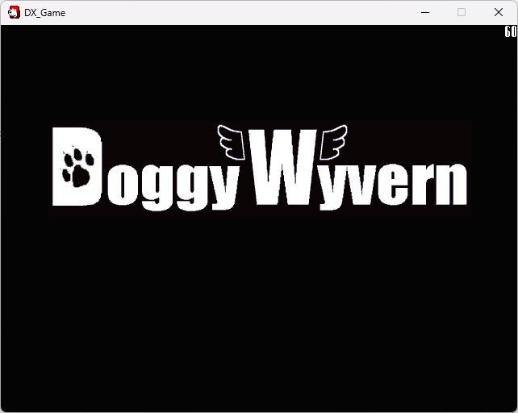

# DoggyWyvernRecreation
A recreation of Pixel's unreleased game

---



## For Building
```
cmake -B build -DCMAKE_BUILD_TYPE=Release -DCMAKE_MSVC_RUNTIME_LIBRARY=MultiThreaded
```

## Progress
- [ ] All stages exported as files instead of being hardcoded in
- [ ] Stage 1 Intro Sequence
- [x] Stage 1 Layout (missing only a few things)
- [ ] Stage 1 Sequence
- [ ] Stage 2 Layout
- [ ] Stage 2 Sequence
- [ ] Stage 2 Boss (Graphics/Function)
- [ ] Rest of the sounds
- [ ] Fix Doggy Ears/Tail
- [ ] Fix "Stage X Start!" animation
- [ ] Rewriting the framework to use legacy directdraw code using the 8-bit palette

## Credits
* Pixel and other colleagues (the original game + assets)
* CSE2/Piyopiyo Decomp (snippits from the original framework)
* AsperD (graphic recreations)
* motorola68000 (graphic recreations)
* RootLM (upcoming Stage 1 theme)
* SSNTails (contributed the Stage 2 theme)
* (others that i've probably forgot to add here, lemme know asap)

## Licensing

Few snippits of CSE2/Piyopiyo decomp code and the recreated assets in this project are proprietary
and belongs to Daisuke "Pixel" Amaya.